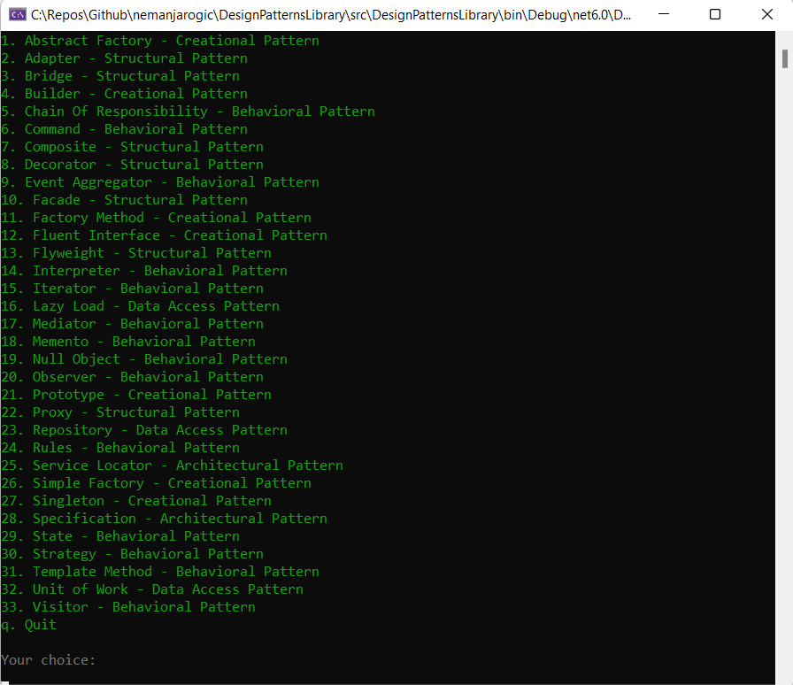

<h1 align="center">Design Patterns Library</h1>

 33 Design Patterns • 73 moderately realistic examples

## What are Design Patterns?
In software engineering, a design pattern is a general repeatable solution to a commonly occurring problem in software design.
A design pattern isn't a finished design that can be transformed directly into code.
It is a description or template for how to solve a problem that can be used in many different situations.
In addition, design patterns allow developers to communicate using well-known, well understood names for software interactions.

Know when to use a certain design pattern, and when not to.
No design pattern is a 42 - the answer to life, the universe and everything. There are situations in which every design pattern easily becomes an antipattern.

## Design Pattern Types
Design patterns can be separated into three main categories:
* Creational
> Creational design patterns are design patterns that deal with object creation mechanisms, trying to create objects in a manner suitable to the situation. The basic form of object creation could result in design problems or added complexity to the design. Creational design patterns solve this problem by somehow controlling this object creation.

* Structural
> Structural design patterns are design patterns that ease the design by identifying a simple way to realize relationships among entities. Structural patterns are concerned with how classes and objects are composed to form larger structures.

* Behavioral
> Behavioral patterns are concerned with algorithms and the assignment of responsibilities between objects. Behavioral patterns describe not just the patterns of objects or classes but also the patterns of communication between them.

## What this repository contains?
This repository contains a comprehensive design patterns library implemented in C#, which covers various design patterns from the most commonly used ones (Gang of Four) to the lesser-known ones. It enables you to get familiar with and learn design patterns through moderately realistic examples.

| Design Pattern        | Type           | Description  | Introduction  |
| ------------- |:-------------:| -----|:-------------:|
| [Abstract Factory](https://github.com/nemanjarogic/DesignPatternsLibrary/tree/main/src/CreationalPatterns/AbstractFactory) | Creational | Provides an interface for creating families of related or dependent objects without specifying their concrete classes.|  |
| [Adapter](https://github.com/nemanjarogic/DesignPatternsLibrary/tree/main/src/StructuralPatterns/Adapter/AdapterLibrary) | Structural | Allows objects with incompatible interfaces to collaborate.|  |
| [Bridge](https://github.com/nemanjarogic/DesignPatternsLibrary/tree/main/src/StructuralPatterns/Bridge/BridgeLibrary) | Structural | Lets you split a large class or a set of closely related classes into two separate hierarchies—abstraction and implementation—which can be developed independently of each other.|  |
| [Builder](https://github.com/nemanjarogic/DesignPatternsLibrary/tree/main/src/CreationalPatterns/Builder/CustomSandwichBuilder) | Creational | Lets you construct complex objects step by step. The pattern allows you to produce different types and representations of an object using the same construction code.|  |
| [Chain Of Responsibility](https://github.com/nemanjarogic/DesignPatternsLibrary/tree/main/src/BehavioralPatterns/ChainOfResponsibility/ChainOfResponsibilityLibrary) | Behavioral | Lets you pass requests along a chain of handlers. Upon receiving a request, each handler decides either to process the request or to pass it to the next handler in the chain.|  |
| [Command](https://github.com/nemanjarogic/DesignPatternsLibrary/tree/main/src/BehavioralPatterns/Command/CommandLibrary) | Behavioral | Turns a request into a stand-alone object that contains all information about the request. This transformation lets you parameterize methods with different requests, delay or queue a request’s execution, and support undoable operations.|  |
| [Composite](https://github.com/nemanjarogic/DesignPatternsLibrary/tree/main/src/StructuralPatterns/Composite/CompositeLibrary) | Structural | Lets you compose objects into tree structures and then work with these structures as if they were individual objects. Treat individual objects and compositions of objects uniformly.|  |
| [Decorator](https://github.com/nemanjarogic/DesignPatternsLibrary/tree/main/src/StructuralPatterns/Decorator/DecoratorLibrary) | Structural | Lets you attach new behaviors to objects by placing these objects inside special wrapper objects that contain the behaviors. Extend or alter the functionality of objects at runtime.|  |
| [Facade](https://github.com/nemanjarogic/DesignPatternsLibrary/tree/main/src/StructuralPatterns/Facade/FacadeLibrary) | Structural | Provides a simplified interface to a library, a framework, or any other complex set of classes. This makes a complex body of code simpler to use and consume.|  |
| [Factory Method](https://github.com/nemanjarogic/DesignPatternsLibrary/tree/main/src/CreationalPatterns/FactoryMethod/RestaurantManagement) | Creational | Provides an interface for creating objects in a superclass, but allows subclasses to alter the type of objects that will be created.|  |
| [Flyweight](https://github.com/nemanjarogic/DesignPatternsLibrary/tree/main/src/StructuralPatterns/Flyweight/FlyweightLibrary) | Structural | Lets you fit more objects into the available amount of RAM by sharing common parts of state between multiple objects instead of keeping all of the data in each object. It reduces storage costs for a large number of objects.|  |
| [Iterator](https://github.com/nemanjarogic/DesignPatternsLibrary/tree/main/src/BehavioralPatterns/Iterator/IteratorLibrary) | Behavioral | Lets you traverse elements of a collection without exposing its underlying representation (list, stack, tree, etc.)|  |
| [Mediator](https://github.com/nemanjarogic/DesignPatternsLibrary/tree/main/src/BehavioralPatterns/Mediator/MediatorLibrary) | Behavioral | Lets you reduce chaotic dependencies between objects. The pattern restricts direct communications between the objects and forces them to collaborate only via a mediator object.|  |
| [Memento](https://github.com/nemanjarogic/DesignPatternsLibrary/tree/main/src/BehavioralPatterns/Memento/MementoLibrary) | Behavioral | Lets you save and restore the previous state of an object without revealing the details of its implementation.|  |
| [Observer](https://github.com/nemanjarogic/DesignPatternsLibrary/tree/main/src/BehavioralPatterns/Observer/ObserverLibrary) | Behavioral | Lets you define a subscription mechanism to notify multiple objects about any events that happen to the object they are observing.|  |
| [Prototype](https://github.com/nemanjarogic/DesignPatternsLibrary/tree/main/src/CreationalPatterns/Prototype/PrototypeLibrary) | Creational | Lets you copy existing objects without making your code dependent on their classes.|  |
| [Proxy](https://github.com/nemanjarogic/DesignPatternsLibrary/tree/main/src/StructuralPatterns/Proxy/ProxyLibrary) | Structural | Lets you provide a substitute or placeholder for another object. A proxy controls access to the original object, allowing you to perform something either before or after the request gets through to the original object. |  |
| [Singleton](https://github.com/nemanjarogic/DesignPatternsLibrary/tree/main/src/CreationalPatterns/Singleton/Greeter) | Creational | Ensures that a class has only one instance, while providing a global access point to this instance.|  |
| [State](https://github.com/nemanjarogic/DesignPatternsLibrary/tree/main/src/BehavioralPatterns/State/StateLibrary) | Behavioral | Lets an object alter its behavior when its internal state changes. It appears as if the object changed its class. This pattern is close to the concept of finite-state machines.|  |
| [Strategy](https://github.com/nemanjarogic/DesignPatternsLibrary/tree/main/src/BehavioralPatterns/Strategy/StrategyLibrary) | Behavioral | Enables an algorithm’s behavior to be selected at runtime. The pattern defines a family of algorithms, encapsulates each algorithm and makes the algorithms interchangeable within that family. In other words, this pattern is used when we have multiple algorithms for a specific task and we want the client to decide which actual implementation should be used at runtime.|  |
| [Template Method](https://github.com/nemanjarogic/DesignPatternsLibrary/tree/main/src/BehavioralPatterns/TemplateMethod/TemplateMethodLibrary) | Behavioral | Defines the skeleton of an algorithm in the superclass but lets subclasses override specific steps of the algorithm without changing its structure.|  |
| [Visitor](https://github.com/nemanjarogic/DesignPatternsLibrary/tree/main/src/BehavioralPatterns/Visitor/VisitorLibrary) | Behavioral | A way of separating an algorithm from an object structure on which it operates. A practical result of this separation is the ability to add new operations to existing object structures without modifying the structures.|  |

### Extra content

| Design Pattern        | Type           | Description  |
| ------------- |:-------------:| -----|
| [Event Aggregator](https://github.com/nemanjarogic/DesignPatternsLibrary/tree/main/src/AdditionalPatterns/EventAggregator/StoreManagement) | Behavioral | Channel events from multiple objects into a single object to simplify registration for clients.|
| [Fluent Interface](https://github.com/nemanjarogic/DesignPatternsLibrary/tree/main/src/AdditionalPatterns/FluentInterface/FluentInterfaceLibrary) | Creational | Provides an easy-readable, flowing interface, that often mimics a domain specific language. Using this pattern results in code that can be read nearly as human language.|
| [Interpreter](https://github.com/nemanjarogic/DesignPatternsLibrary/tree/main/src/AdditionalPatterns/Interpreter/InterpreterLibrary) | Behavioral | Defines a grammatical representation for a language and provides an interpreter to evaluate sentences in a language.|
| [Lazy Load](https://github.com/nemanjarogic/DesignPatternsLibrary/tree/main/src/AdditionalPatterns/LazyLoad/LazyLoadLibrary) | Data Access | Defers initialization of an object until the point at which it is needed. It can contribute to efficiency in the program's operation if properly and appropriately used.|
| [Null Object](https://github.com/nemanjarogic/DesignPatternsLibrary/tree/main/src/AdditionalPatterns/NullObject/NullObjectLibrary) | Behavioral | Encapsulates the absence of an object by providing a substitutable alternative that offers suitable default do nothing behavior.|
| [Repository](https://github.com/nemanjarogic/DesignPatternsLibrary/tree/main/src/AdditionalPatterns/Repository/OrderManagement) | Data Access  | Encapsulates all the minutiae of data access. Mediates between the domain and data mapping layers using a collection-like interface for accessing domain objects.|
| [Rules](https://github.com/nemanjarogic/DesignPatternsLibrary/tree/main/src/AdditionalPatterns/Rules/RulesLibrary) | Behavioral | Separates the logic of each individual rule and its effects into its own class. Separates the selection and processing of rules into a separate Evaluator class.|
| [Service Locator](https://github.com/nemanjarogic/DesignPatternsLibrary/tree/main/src/AdditionalPatterns/ServiceLocator/OrderProcessing) | Architectural | Improves the modularity of your application by removing the dependency between the client and the implementation of an interface. Encapsulates the processes involved in obtaining a service with a strong abstraction layer. This pattern uses a central registry known as the service locator which on request returns the information necessary to perform a certain task.|
| [Specification](https://github.com/nemanjarogic/DesignPatternsLibrary/tree/main/src/AdditionalPatterns/Specification/ProductSpecification) | Architectural | Separates the statement of how to match a candidate, from the candidate object that it is matched against. Specification design pattern allows us to check whether our objects meet certain requirements. Through this design pattern, we can reuse expression specifications and combine those specifications to easily question whether more complex requirements are satisfied or not.|
| [Unit Of Work](https://github.com/nemanjarogic/DesignPatternsLibrary/tree/main/src/AdditionalPatterns/UnitOfWork/UnitOfWorkLibrary) | Data Access | Maintains a list of objects affected by a business transaction and coordinates the writing out of changes.|

### How to run
The solution contains one executable project called `DesignPatternsLibrary`.\
Run the solution and you will get a menu from which you can choose a design pattern.

Compare the output from the console with the code for the chosen design pattern.\
Repeat!

The solution can be run using either `.NET 5` (choose .NET 5 [branch](https://github.com/nemanjarogic/DesignPatternsLibrary/tree/dotnet-5) or [release](https://github.com/nemanjarogic/DesignPatternsLibrary/releases/tag/v5.0.0)) or `.NET 6` (the default option).

### Afterword

For learning more about design patterns, I highly recommend:
- Visiting [Refactoring.Guru](https://refactoring.guru/) website for amazing content about design patterns
- Reading the `Head First Design Patterns: A Brain-Friendly Guide` book
- Watching courses about design patterns available on various learning platforms. The idea for this repository has been born after watching [Design Patterns Library course](https://www.pluralsight.com/courses/patterns-library) created by `Steve Smith, Robert Horvick, Brian Lagunas, David Starr, Keith Sparkjoy, Niraj Bhatt, Glenn Block, Scott Allen, John Brown and Donald Belcham`.
- Visiting blogs like [ExceptionNotFound](https://exceptionnotfound.net/), [Ardalis](https://ardalis.com/blog) or [Enterprise Craftsmanship](https://enterprisecraftsmanship.com/posts)

The examples that are used to demonstrate design patterns usage are a mix of my own ideas and ideas adapted from various resources (some of them are mentioned above).
